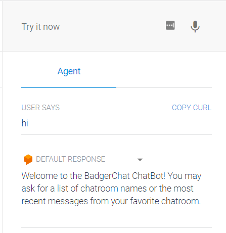
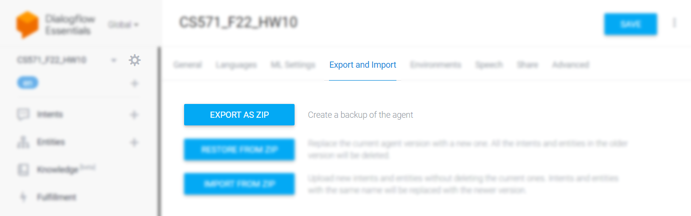
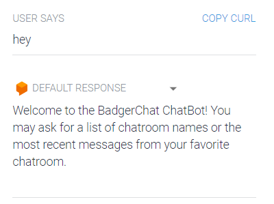
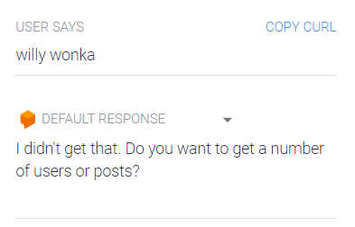
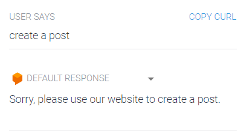
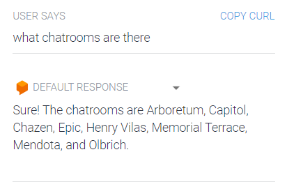
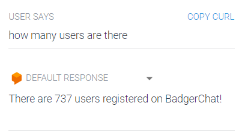
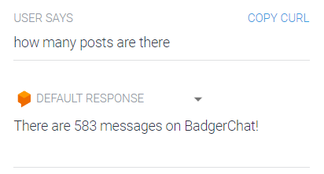
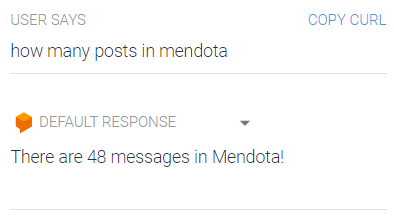
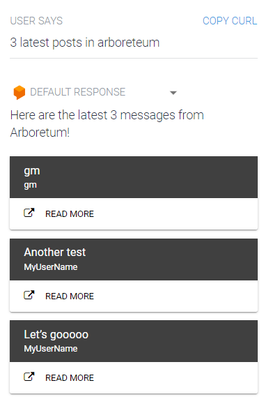

# CS571-S23 HW12: BadgerChat

Welcome back to our final homework, once again, on BadgerChat! For this assignment, you will re-implement BadgerChat as *a voice application*. By completing this class, you will have developed a web, mobile, and voice interface for BadgerChat! 🥳🎉 **There is no design aspect for this assignment.** You may assess your voice interface using what we learned in *usability evaluation*, but it is **not** a requirement.

## BadgerChat

You will complete both a [DialogFlow Agent](https://dialogflow.cloud.google.com/) and this webhook as a part of this assignment. Your DialogFlow agent will act as a sort of "frontend" which communicates between the user and this webhook, and this webhook will act as a sort of "midend" which communicates with the BadgerChat API.

The webhook starter code provided to you is an [express](https://expressjs.com/) server outfitted with [morgan](https://www.npmjs.com/package/morgan) for logging, [nodemon](https://nodemon.io/) for hot-reloading, and [ngrok](https://ngrok.com/) for publishing.

You will need to create your DialogFlow agent at [dialogflow.cloud.google.com](https://dialogflow.cloud.google.com/). When you are finished, you will export your DialogFlow agent as a `.zip` by clicking the settings icon > Export and Import > Export as Zip. Include this zip as a file in your GitHub Classroom submission.

### Setup

#### **Setup DialogFlow Agent**

You will need to create your DialogFlow agent at [dialogflow.cloud.google.com](https://dialogflow.cloud.google.com/). 

#### **Setup Webhook**

First, run `npm install` in this directory.

Then, [register for an ngrok account](https://ngrok.com/).

Finally, place your [ngrok auth token](https://dashboard.ngrok.com/get-started/your-authtoken) in a file called `token.secret`. This file will *not* be committed.

### Running

#### **Running Webhook**

Open **two terminals**. In one terminal, run `npm start`. In your second terminal, run `npm run tunnel`.

`npm start` will start your application while `npm run tunnel` publishes your server to the world. You can check that the webhook is running by visiting both `http://localhost:53705` and your ngrok url. A message should be displayed that says "Express Server Works!"

**Note:** You may get a warning when visiting the ngrok url in your browser; this is okay! It is a security feature.

#### **Running DialogFlow Agent**

Simply open [dialogflow.cloud.google.com](https://dialogflow.cloud.google.com/) and enter a query into the prompt. For intents that require a webhook, you will have to paste your ngrok url into the "Fulfillment" section of DialogFlow. Make sure to press "Save". **This url will change each time you run `npm run tunnel`!**

### API Notes

All data can be retrieved via API calls to `https://cs571.org/s23/hw12/api/`.

This HW shares the same database as HW6 and HW10. This API has the same endpoints as HW6 (using cookie-based auth) **as well as some new ones described below.** For complete documentation, see `API_DOCUMENTATION.md`

| Method | URL | Purpose | Return Codes |
| --- | --- | --- | --- |
| `GET` | `/chatroom` | Get all chatrooms. | 200, 304 |
| `GET` | `/numUsers` | Get the number of users registered on BadgerChat. | 200, 304 |
| `GET` | `/numMessages` | Get the number of messages on BadgerChat. | 200, 304 |
| `GET`| `/chatroom/:chatroomName/numMessages` | Get the number of messages for the specified chatroom. | 200, 304, 404 |
| `GET` | `/chatroom/:chatroomName/messages`| Get latest 25 messages for specified chatroom. | 200, 304, 404 |
| `GET` | `/chatroom/:chatroomName/messages/:messageId`| Get the information for the specified message. | 200, 304, 404 |
| `POST` | `/chatroom/:chatroomName/messages` | Posts a message to the specified chatroom. Requires JWT. | 200, 400, 404, 413 |
| `DELETE` | `/chatroom/:chatroomName/messages/:messageId` | Deletes the given message. Requires JWT. | 200, 400, 401, 404 |
| `POST` | `/register` | Registers a user account and returns a JWT. | 200, 400, 401, 409, 413  |
| `POST` | `/login` | Logs a user in, returning a JWT. | 200, 400, 401, 404 |
| `GET` | `/whoami` | Gets details about the currently logged in user. | 200, 401 |

An unexpected server error `500` *may* occur during any of these requests. It is likely to do with your request. If the error persists, please contact a member of the course staff.

## BadgerChat Voice

### 0. Setup Work

In addition to pasting your ngrok token into a file called `token.secret`, you will also need to paste your `X-CS571-ID` into [BadgerChat Web](https://cs571.org/s23/badgerchat). BadgerChat Web will be used later in this assignment.

### 1. Default Welcome and Fallback Intents

When the user says something along the lines of "hi" or if the user is lost, give them some actions they can do. This does *not* need to be an exhaustive list.

### 2. Create a Post Intent

BadgerChat Voice will not support creating a post; it will be read-only. If the user asks to make a post, tell them to visit our website. You do not need to provide a link to the website (though this would make for a better user experience!).

### 3. Chatroom Names Intent

When the user asks what chatrooms are available, return a list of chatroom names. You do not need to use the webhook for this; you may hardcode the names of the chatrooms into the DialogFlow agent.

### 4. Number of Users Intent

When the user asks how many accounts have been registered, you should return [a text response](https://cloud.google.com/dialogflow/es/docs/fulfillment-webhook#text_response) with the number of accounts. **You will need to use the webhook for this intent.**

**You must use `async`/`await` syntax!** Do not use `.then`.

### 5. Number of Posts Intent

When the user asks how many posts have been made, return the total number of posts on BadgerChat. Furthermore, if the user specifies a specific chatroom, you should return the number of posts for that specific chatroom. Both should be [text reponses](https://cloud.google.com/dialogflow/es/docs/fulfillment-webhook#text_response). **You will need to use the webhook for this intent.**

**You must use `async`/`await` syntax!** Do not use `.then`.

### 6. Get Posts Intent
The user should be able to read a number of posts that are in the chatroom they specify. They must specify a chatroom name, but if they do not specify a number of posts, assume they only want to view the 1 latest post. If they specify that they want to see more than 5 posts, show them *at most* the 5 latest posts.

Use a [card response](https://cloud.google.com/dialogflow/es/docs/fulfillment-webhook#card_response) to display the post's title and author. Furthermore, include a button that will allow the user to read more. When the user clicks this button, direct them to its full description on the BadgerChat website (details below).

You can show a post's full details by navigating to `https://cs571.org/s23/badgerchat/chatrooms/CHATROOM_NAME/messages/POST_ID`, e.g. https://cs571.org/s23/badgerchat/chatrooms/Bascom/messages/2468. 

**You will need to use the webhook for this intent.** You will use the BadgerChat API to *get* the latest posts, and you will *direct* the user to `https://cs571.org/s23/badgerchat/chatrooms/CHATROOM_NAME/messages/POST_ID` to view the post in greater detail.

**You must use `async`/`await` syntax!** Do not use `.then`.

### Other Notes
**You should include multiple training phrases (3+) for each intent.** However, you do not need multiple responses for your intents; one response will do.

**You must use `async`/`await` syntax!** Do not use `.then`.

When you are complete, I would expect your DialogFlow agent to have the following intents...

 - Default Welcome Intent
 - Default Fallback Intent
 - CreateAMessage
 - GetChatroomNames
 - GetNumUsers
 - GetNumMessages
 - GetChatroomMessages

### Submission Details
In addition to your code, **you will also need to submit a video recording of your app**. Like the demo video, it should cover all the tasks below. Please thoroughly demonstrate all tasks to showcase the capabilities of your app.

**Please embed your recording as a Kaltura video as a part of the assignment submission.** You may find [Zoom](https://support.zoom.us/hc/en-us/articles/201362473-Enabling-and-starting-local-recordings) helpful for recording your screen.

#### Tasks 
 - Show the welcome intent
 - Show the fallback intent
 - Show that the user cannot create a message
 - Show the chatroom names intent
 - Show the number of registered users intent
 - Show the number of posts intent...
   - ...for all of BadgerChat
   - ...for a specific chatroom of BadgerChat
 - Show the get posts intent...
   - ... for no specified number of posts
   - ... for 3 posts
   - ... for >5 posts
   - ... also show the modal opening in a new page

