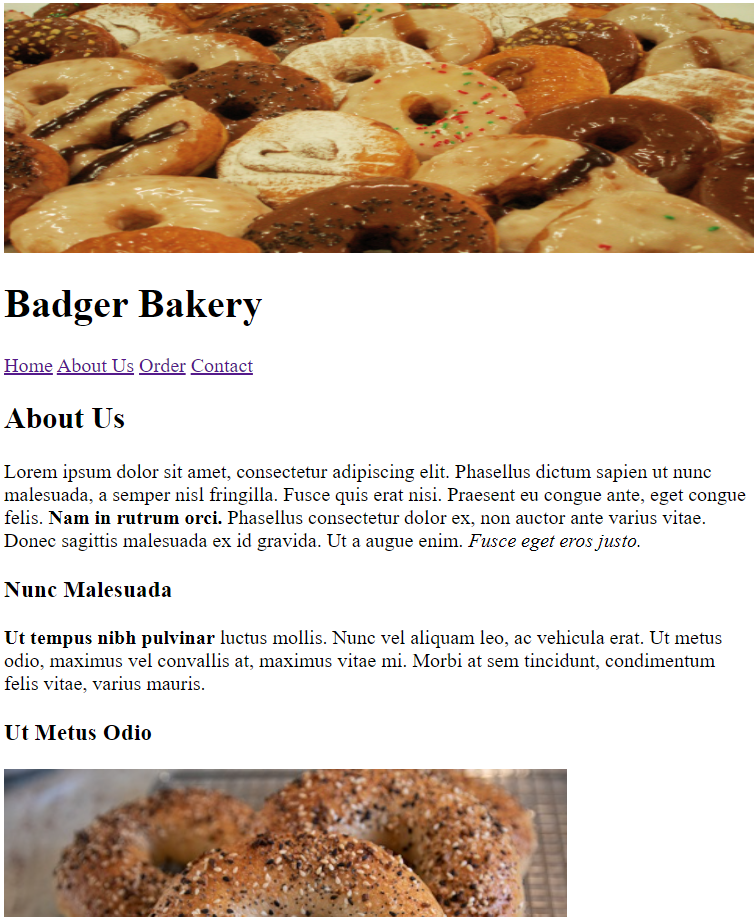
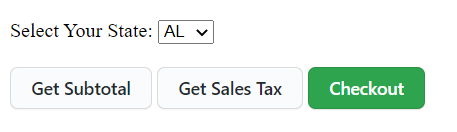
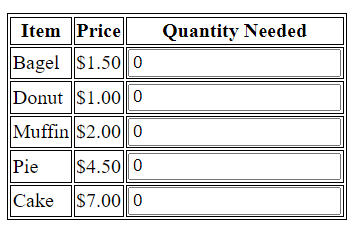
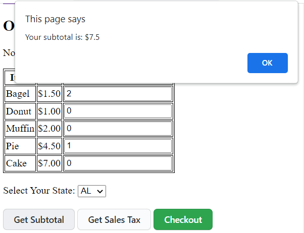
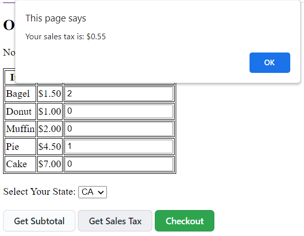
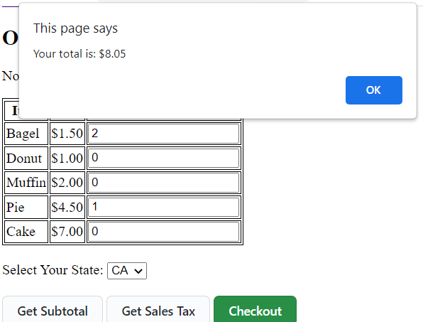
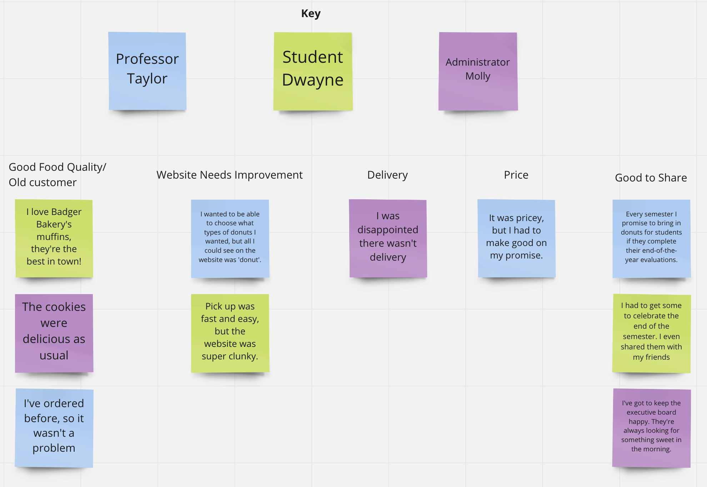
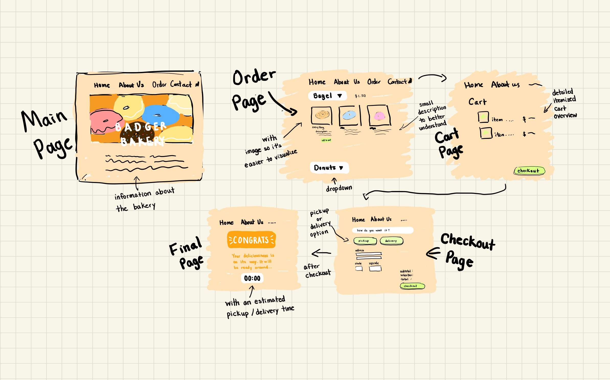

[](https://classroom.github.com/online_ide?assignment_repo_id=9949425&assignment_repo_type=AssignmentRepo)
# CS571-S23 HW02: Badger Bakery

Welcome to Badger Bakery! For this assignment, you will be completing the functionality of the `.html`, `.css`, and `.js` files. You will also be getting a secret code from our first API. Following, you will complete the design thinking process in this `README.md`.  **Make sure to complete all sections.**

## JavaScript Essentials

All `.html`, `.css`, and `.js` files are located in the `badger-bakery` folder. You can load any of the webpages in a web browser. I recommend using [Visual Studio Code](https://code.visualstudio.com/) to do your development work.

### 1. About Us Page

The `about-us.html` page is currently empty. Make a *plausible-looking* About Us page using text generated from [lorem ipsum](https://www.lipsum.com/) or [ChatGPT](https://chat.openai.com/chat). On this page, you should use multiple heading levels, **bold** and *italic* text (remember to use the locale-appropriate tags!), and insert the image from `assets/bagel.jpg`. There are no other strict requirements for this section, see the screenshot below for an example.

___




### 2. Button Styling

All of our buttons look the same! However, if you look at the `.html` files, we do distinguish between CSS classes `primary-button` and `secondary-button`. Using `styles.css`, give `primary-button` and `secondary-button` three different CSS attributes (e.g. change the `background-color`, `border`, `padding`, or any other CSS attributes of each). Again, there are no other strict requirements for this section, see the screenshot below for an example.

___




### 3. Adding Cakes

What kind of bakery doesn't sell cakes!? Add another entry to the table in `order.html` to be able to order "cake" for $7.00 each.

___




### 4. Calculating Subtotal.

In `app.js`, implement the function `calculateSubtotal`. You must use the `document` object to access the input fields, but you may hardcode the price for each of the items.

This function should calculate the sum cost of all baked goods ordered. When this function is properly implemented, in the browser, you can calculate your subtotal using the "Get Subtotal" button.

For example, ordering two bagels and one pie should cost $7.5.

Do not worry about trailing zeroes, e.g. 38.5 instead of 38.50 is okay! You do *not* have to validate user input; you can assume users will always enter natural numbers for quantities.

___




### 5. Calculating Sales Tax

In `app.js`, implement the function `calculateSalesTax`. You must use the `document` object to access the select box, and you must apply the sales tax to the amount from `calculateSubtotal`.

Keep in mind that sales tax differs by state! Use the `SALES_TAX` object to lookup the sales tax percentage for the selected state. Use the `roundMoney` function to round to the nearest penny.

When this function is properly implemented, in the browser, you can calculate your subtotal using the "Get Sales Tax" button. 

For example, when ordering two bagels and one pie ($7.5), the Alabama sales tax should be $0.3 while the California sales tax should be $0.55. The number should be rounded to two decimal places, but you do not need to worry about trailing zeroes.

___




### 6. Completing Order

In `app.js` add an event listener that waits for the "Checkout" button to be pressed. When the checkout button is pressed, alert the user what their total bill is (using `calculateSubtotal` and `calculateSalesTax`).

**Note:** We won't learn about APIs until Thursday's lecture, so we won't make an *actual* transaction. This is just "for show". In future assignments, we will learn about using APIs to work with *backends* and make *actual* transactions.

___




### 7. Secret Code
That's all for your HTML, JS, and CSS code!

This last step requires the use of [Postman](https://www.postman.com/). A 5-digit secret code has been placed at https://cs571.org/s23/hw2/api/test. Use Postman to perform a `GET` request to https://cs571.org/s23/hw2/api/test to reveal the secret 5-digit code. You will need to use your unique bid (found in your email) as a X-CS571-ID header to reveal the secret code. Modify this README.md so that ##### is replaced by the secret code.

**5-Digit Secret Code:** 12345

*If you did not recieve a unique ID, contact me no later than Monday at noon.*

___


## Design Thinking 

Complete this part of the assignment *after* your complete the implementation of Badger Bakery. If you are unable to complete the implementation of Badger Bakery, complete this to the best of your ability.

Here, you will complete the 6-step process of design thinking: empathizing, defining, ideating, prototyping, testing, and implementing Badger Bakery. **Please type your responses in this `.md` file where indicated.** If a response asks you to upload a figure or attachment, include those underneath the `figures` directory. Images can be included using the following markdown format: ``

Tasks "empathize", "prototype", and "implement" do not have any deliverables.

### 1. Empathize

It's nearing the end of the semester, and your website, Badger Bakery, has been overloaded with traffic from the local university. Curious, you ask for the feedback of three people to talk about their experience: Professor Taylor, Student Dwayne, and Administrator Molly in order to empathize with them.

**Professor Taylor:** "Every semester I promise to bring in donuts for students if they complete their end-of-the-year evaluations. The administration doesn't like me bringing food into the building, but I've always gotten away with it. It was pricey, but I had to make good on my promise. I wanted to be able to choose what types of donuts I wanted, but all I could see on the website was 'donut'." 

**Student Dwayne:** "I love Badger Bakery's muffins, they're the best in town! I had to get some to celebrate the end of the semester. I even shared them with my friends. Pick up was fast and easy, but the website was super clunky. It felt like it was from the early 2000s. I've ordered before, so it wasn't a problem, it was just annoying."

**Administrator Molly:** "I've got to keep the executive board happy. They're always looking for something sweet in the morning. I was disappointed there wasn't delivery, though. My administrative assistant was away for an hour to pick them up. It made me miss an important phone call. The cookies were delicious as usual, though."

There is no deliverable for empathizing, it has already been done for you!

### 2. Define

Now that we have gathered the users' responses, we must make sense of them! Make 10 to 15 post-it notes that represent an individual's direct quote or a general idea. Make sure to include the individual's name on each post-it note! These may be physical post-it notes or virtual post-it notes using tools such as [Google Drawing](https://docs.google.com/drawings/u/0/create) or [Miro](https://miro.com/).

Use affinity diagramming to construct categories about your users' experiences.  Refine your groupings iteratively until you have 3-5 categories. Include a screenshot of your affinity diagram below.



### 3. Ideate

Think big. Gaining inspiration from your affinity diagram, what could be changed about the Badger Bakery website? Remember to be creative and outrageous. These ideas don't have to be complete thoughts or sentences, go for quantity over quality (aim for 5-10 ideas). Include one *annotated* sketch of what Badger Bakery could look like.

1. Add a delivery option, so customer can easily get the food.
2. Add images of different bakery items so customer can visualize what the bakery offers
3. Make the website less clunky by makig it more simplistic
4. Add an estimate time of pickup to save customer's time
5. Detailed Itemized overview


### 4. Prototype

At this point, we would rein in our creativity and be selective of which ideas we move forward with to prototype. We haven't covered prototyping yet, so we will practice this later.

There is no deliverable for prototyping, it will be done later in the semester!

### 5. Test

Design a task with its corresponding pass/fail criteria that tests the implementation of one or more of your ideas. For example, if one of our ideas was to add a chatbot to our website to process orders, the following task and pass/fail criteria could be used.

```
ChatBot Usability Test: Using the chatbot on Badger Bakery, order one dozen bagels to be delivered to your spouse's office on Monday morning. The task will be considered to be completed successfully if the user recieves confirmation that their order has been placed. The task will be considered to be failed if the user fails to schedule their delivery, or if they have to use mechanisms other than the chatbot to complete their order.
```

```
Timer Usability Test: Placed an order on the Badger Bakery website. The task will be considered to be completed successfully if the user recieves an estimated time that their order will be completed. The task will be considered to be failed if the user fails to received an estimated time, or if the estimated time doesn't make sense. 
```
### 6. Implement

We've done enough coding for this week! There is no deliverable for implementing.

