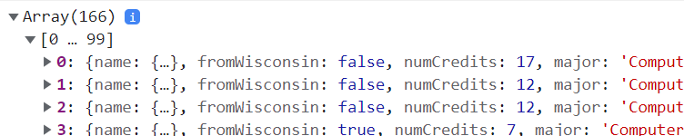
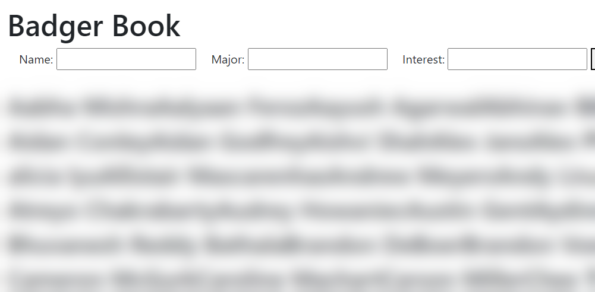
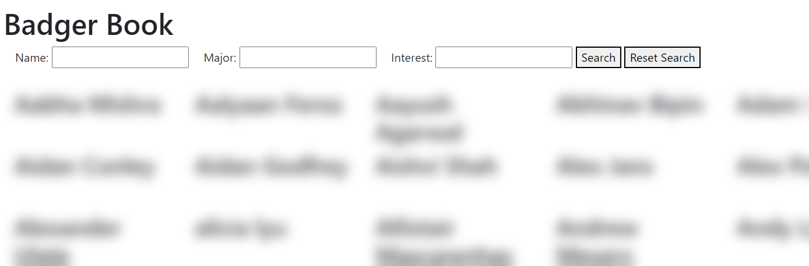
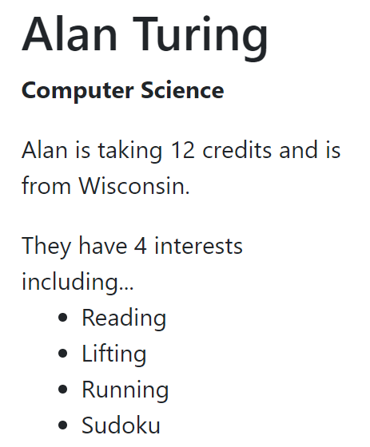
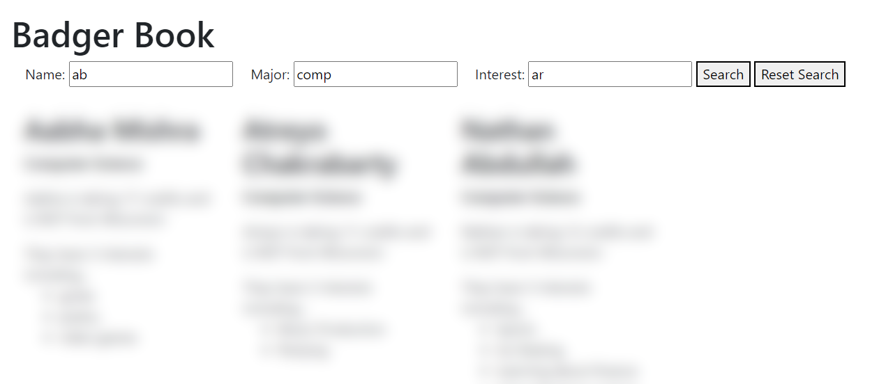
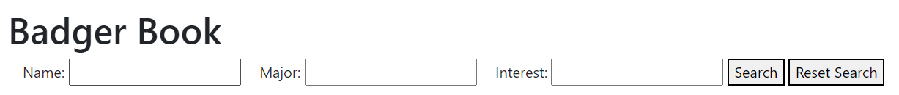

# CS571-S23 HW03: Badger Book

Welcome to Badger Book! Classroom introductions scale in O(n) time, so in this assignment we will speed up that process! In HW1, we collected JSON data about you; in this assignment, you will present this JSON data on a webpage: Badger Book. You'll fetch data from the API, present it on a webpage, and provide search functionality to speed up the introduction process! Because we had just completed the JavaScript Bootcamp, *there is no design aspect to this assignment*.

**Note:** If there were issues with your submission or if you had joined the class late, you may not see yourself in the data -- sorry!

## Important

**Note:** For this assignment, you may *only* modify `app.js`. You may *not* modify `index.html`. You will implement the logic in `app.js` to fetch and filter student data to manipulate the DOM of `index.html`.

## Tasks

### 1. Fetch Student Data

Fetch the student data from `https://cs571.org/s23/hw3/api/students`. Note that this requires a `X-CS571-ID` header specifying your unique Badger ID. After fetching this data, `console.log` the contents of this array.

### 2. Displaying Student Names

With this data, display the students' names on the webpage. The helper function `buildStudentsHtml` will return HTML for all student names. Then, you can insert this HTML into the 'students' div of the webpage using [innerHTML](https://developer.mozilla.org/en-US/docs/Web/API/Element/innerHTML).

We will talk about the security implications of `innerHTML` in class.

### 3. Formatting Student Data

This "works"... but the formatting is hard to read. Use [Bootstrap's grid system](https://getbootstrap.com/docs/4.0/layout/grid/) so that...
 - 1 column of students is shown on `xs` devices
 - 2 columns of students is shown on `sm` devices
 - 3 columns of students is shown on `md` devices
 - 4 columns of students is shown on `lg` devices
 - 6 columns of students is shown on `xl` devices

You can re-size your browser window to test this.

**Note:** You don't need to install Bootstrap; you just need to use it! I have included Bootstrap for you already -- see line 4 of `index.html`.

### 4. Add Other Student Data

There's more to a student than just their name! Modify `buildStudentHtml` to display all of the other information about a student. How you choose to do this is up to you, but you must display...
 - first & last name
 - major
 - number of credits
 - if they are from WI
 - their interests **in ul list format** and **their number of interests**

### 5. Search Functionality
With all of the data being displayed, we need to provide the user with a way to narrow down their results. Implement search functionality so that a user may search by name, major, and interests when clicking the "search" button. After clicking "search", the only students that should be displayed are those that match the search criteria.

You will likely need to add an event listener to the 'search-btn' button and get the value from the three text fields; refer back to Badger Bakery if you forgot how to do this!

The following are requirements of the search functionality...
 - search terms are case-insensitive, e.g. searching "cat" should yield results with "cAT"
 - search terms are substrings, e.g. "olo" should yield results with "color"
 - search terms are AND expressions, e.g. searching for a name of "Cole", a major of "Computer Science", and an interest of "coffee" should only yield Coles studying computer science who are interested in coffee
 - searching "john", "smith", or "john smith" should all yield the person named "John Smith"
 - if any interest matches the search term, it should be considered a result, e.g. searching "bow" should yield people with interests in "bow hunting", "bowling", and/or "bowing".
 - if a search term is left blank it should not affect the results of the search
 - leading and trailing spaces of search terms should be ignored

I would *encourage you* but not *require you* to use declarative over imperative programming.

**Note:** There are no Alan Turings, John Smiths or Cole Nelsons in the data, these are just examples.

### 6. Reset Search

When the user clicks the "Reset Search" button, the search term fields should be cleared and all students should be displayed.

### Done! 🥳

Congrats! Add, commit, and push your files to GitHub Classroom and paste your commit hash in the Canvas assignment.

There is no design aspect to this assignment.
