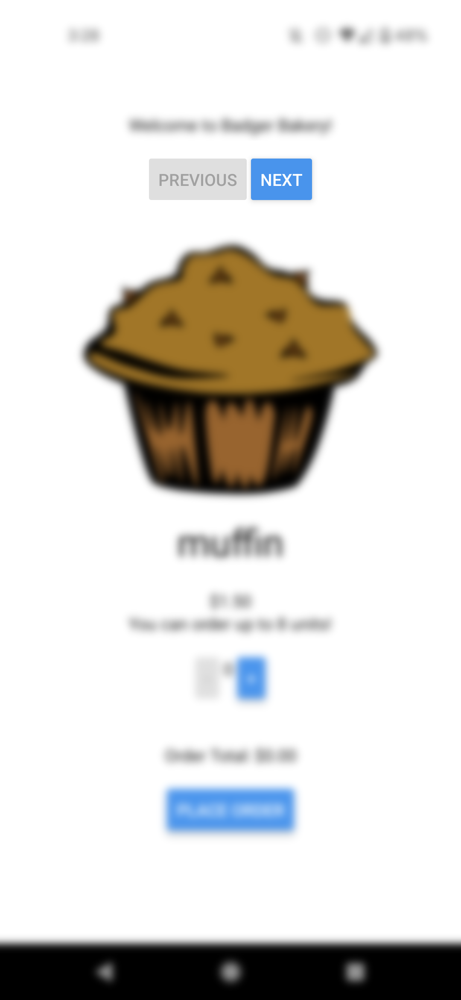
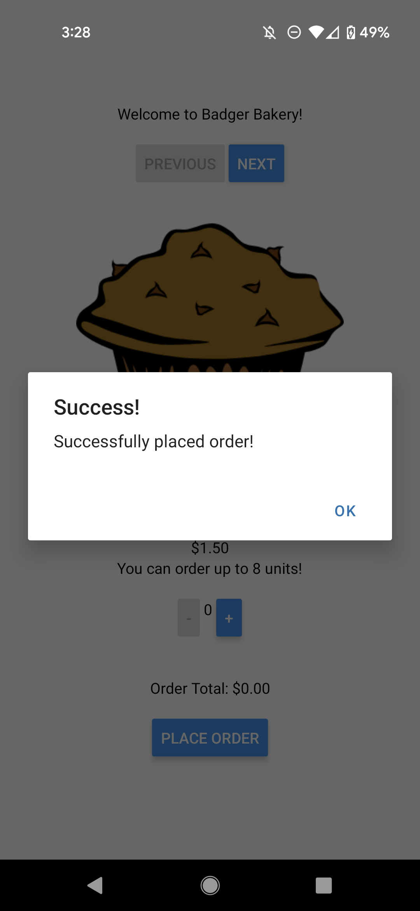

[](https://classroom.github.com/online_ide?assignment_repo_id=10660308&assignment_repo_type=AssignmentRepo)

# CS571-S23 HW8: Badger Bakery

```
Once upon a time, there was a badger named Bucky who had a talent for coding. He was fascinated by the world of software engineering and spent most of his free time tinkering with code. After completing his studies, he landed a job as a software engineer at a tech company.

At first, Bucky was excited about his new job. He loved the challenge of creating software and solving complex problems. However, over time, he began to feel unfulfilled. He realized that he missed the tangible aspect of creating something that people could see, touch, and taste.

One day, while walking through the city, Bucky stumbled upon a bakery. The smell of freshly baked bread and pastries filled the air, and he felt a sudden urge to learn more about baking. He started to experiment with recipes in his free time and soon discovered that he had a natural talent for baking.

Bucky made the difficult decision to leave his job as a software engineer and open his own bakery. He poured all of his passion and creativity into creating delicious treats for his customers. To help promote his new business, Bucky used his coding skills to build a website and mobile app for his bakery, using JavaScript to make it interactive and user-friendly.

Today, Bucky is known throughout the community for his delectable baked goods and his innovative website and mobile app. He may have left the world of software engineering behind, but he found a new passion in the art of baking, and he couldn't be happier.
```

Backstory generated using [ChatGPT](https://chat.openai.com/chat).

---

Welcome to Badger Bakery! For this assignment, you will both prototype and implement a mobile app for Badger Bakery.

**Make sure to complete both parts of this assignment.**

## Badger Bakery Prototype

Create a [Figma prototype](http://figma.com/) for Badger Bakery. This prototype should be based on the requirements of *Badger Bakery Mobile* (not Badger Bakery Web!) which are...

1. Allow the customer to view some baked goods (e.g. muffins, pies, donuts, etc.)
2. Allow the customer to add baked goods to their basket.
2. Allow the customer to check out.

Your prototype should be built for a mobile device, though you can choose what particular model of phone it is for. Your prototype should also be low fidelity -- focus on the structural layout and don't get too caught up in your choice of fonts and pixel perfection. Furthermore, you don't need to prototype every "route" of the prototype -- it is perfectly fine to only show muffins being added to the basket but not donuts or pies. Furthermore, choosing quantities can be "hardcoded" -- e.g. three donuts can be added at once rather than clicking the add button three times. Prototyping input elements is difficult, so it is okay to "hardcode" their results.

 **You will not be forced to implement your prototype in code,** so get creative! The implementation you do is shown in the screenshots and demo video below, but your prototype can look different!

When you are done, paste your *view-only* Figma link below. Make sure that it is **public**. *You can test this by opening the link in an incognito window.* **Not making the Figma link public could lose you points.** [Here is an example Figma prototype.](https://www.figma.com/file/dD7xbQEJWanguhnfwNFf40/BadgerChat-Mobile?node-id=0%3A1&t=7VTTaZERjsAKAgxs-1)

https://www.figma.com/file/P0IgpGs7mAN7XJWvdgNgBU/BadgerBakery?node-id=0%3A1&t=D6NFLtGEjsK4qnQZ-1 

## Badger Bakery Implementation


The starter code provided to you was generated using [expo](https://expo.dev/), therefore the "boilerplate" code has already been generated. **You should *not* re-run the expo init command**. Instead, in this directory, simply run...

```bash
npm install
npm start
```

To test your app, you have a few options. If you have a smart device, I would recommend using the expo app for [iOS](https://apps.apple.com/us/app/expo-go/id982107779) or [Android](https://play.google.com/store/apps/details?id=host.exp.exponent&hl=en_US&gl=US). You can scan the QR code using your phone, or you can launch commands via the terminal. Otherwise, you can use an emulator (such as [AVD](https://developer.android.com/studio/run/emulator)). Do not use the web browser to test your code; you must test on Android or iOS!

Note that we are writing code in JavaScript for React Native; if you begin writing code in Objective-C, Swift, Java, or Kotlin you are likely doing something *very* wrong!

### API Notes

All data can be retrieved via API calls to `https://www.cs571.org/s23/hw8/api/`. A brief overview of the API is provided below. Please refer to `API_DOCUMENTATION.md` for details.

All routes are relative to `https://www.cs571.org/s23/hw8/api/`

| Method | URL | Purpose | Return Codes |
| --- | --- | --- | --- |
| `GET`| `/bakery/items` | Get all bakery items with their associated name, price, image url, and upper bound order limit. | 200, 304 |
| `GET` | `/bakery/images/:itemName`| Get the image for the specified item. | 200, 304, 404 |
| `GET` | `/bakery/order` | Get the most recent orders. | 200, 304 |
| `POST` | `/bakery/order` | Make an order. | 200, 400, 401, 413 |

**When making API calls with a request body, don't forget to stringify and include the header `"Content-Type": "application/json"`**


### 1. Display Baked Goods

**Note:** These screenshots are taken from an older version of Badger Bakery. We have since installed new equipment and can handle slightly larger orders!

Fetch the baked goods from `https://www.cs571.org/s23/hw8/api/bakery/items` and display them to the screen, including their name, image, price, and how many can be ordered. Note that this endpoint returns an *object* and not a *list* -- you may find `Object.keys` helpful here.


### 2. Navigate Between Baked Goods

Instead of showing all baked goods on the same screen, add "Previous" and "Next" buttons to allow the user to navigate between baked goods. The "previous" button should be disabled when viewing the first baked good, and the "next" button should be disabled when viewing the last baked good. You can disable buttons [by adding a `disabled` property](https://reactnative.dev/docs/button).




### 3. Add and Remove from Basket

Allow the user to add and remove items from their basket via "+" and "-" buttons. The "-" button should be disabled when the user has 0 of that item in their basket, and the "+" button should be disabled when the user has reached the `upperBound` of that item.

I'd recommend using a context such as `BadgerOrderContext` that contains how many baked goods are in a user's basket. This context may hold an object that looks like...

```javascript
{
    muffin: 3,
    donut: 0,
    pie: 1,
    cupcake: 0,
    croissant: 2
}
```

... where the value of each item is modified when it has been added/removed from the basket. This is just a *suggestion*.


### 4. Show Order Total

The total cost of the items in the users' basket should be shown.


### 5. Submit Order

The user should be able to submit their order by pressing a "place order" button. Before placing an order, you should confirm that the user has *something* in their basket, otherwise tell them that their basket is empty. To order, you will do a `POST` to the API with the contents in the user's basket.

If there is an error with a request, you should tell the user "Something went wrong!" otherwise tell the user "Successfully placed order!". To quickly do this, you can [use React Native alerts](https://reactnative.dev/docs/alert). After the order has been successfully submitted, you should clear the user's basket.




### Other Notes
You may assume that each bakery item's name is unique and contains a `price`, `img`, and `upperBound`. You should use `toFixed(2)` to format the price/total of any monetary amounts. However, you may *not* hardcode the use of "muffin", "donut", "pie", "cupcake", or "croissant"! Being a busy bakery in Madison, the items we sell may vary from day-to-day, and we should *not* assume we will always be selling these same items.

You can verify that the order has hit the API and has been placed in the database by doing a GET to `https://www.cs571.org/s23/hw8/api/bakery/order` via your browser or Postman. You do *not* need to show the user all of the recent orders, this is simply for you to verify that it has reached the backend.

### Submission Details
In addition to your code, **you will also need to submit a video recording of your app**. Like the demo video, it should cover all the tasks below. Please thoroughly demonstrate all tasks to showcase the capabilities of your app.

**Please embed your recording as a Kaltura video.**

#### Tasks 
 - Navigate between *all* baked good items.
 - Add to the basket both the lower and upper bound of each baked good.
 - Try to submit an order with *no* baked goods.
 - Submit an order with *some* baked goods.
